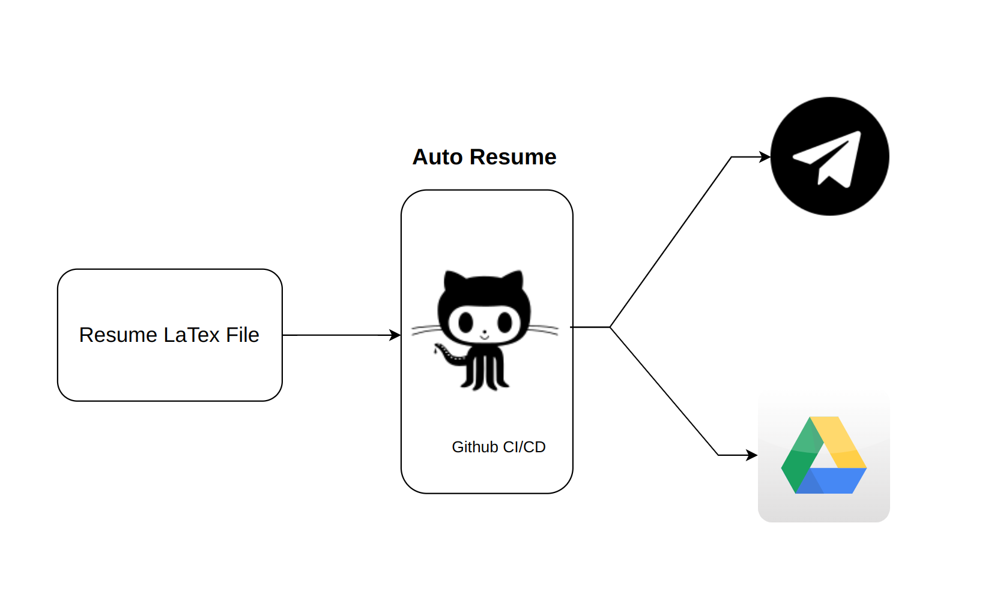
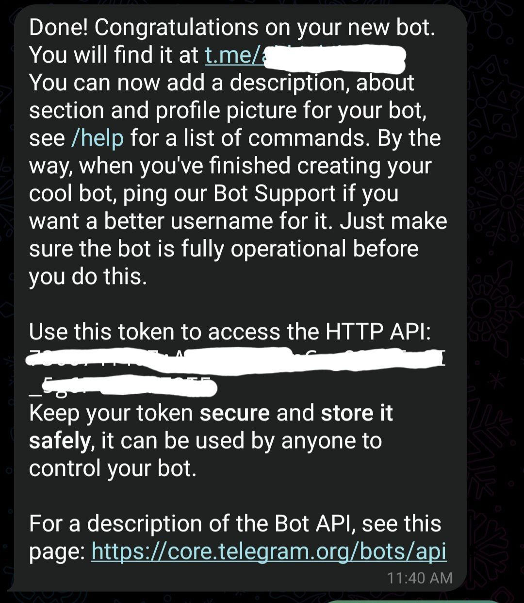
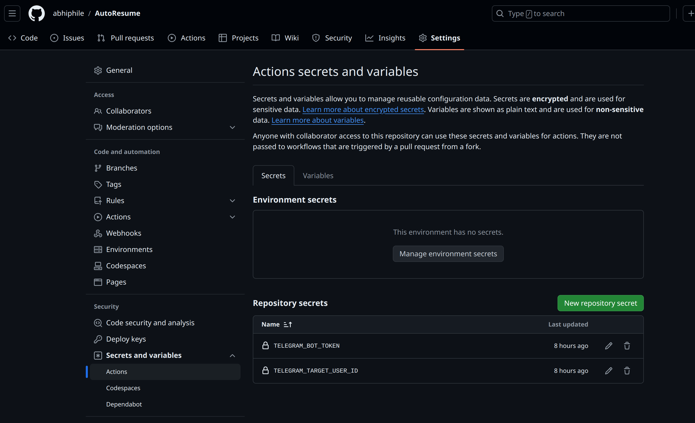
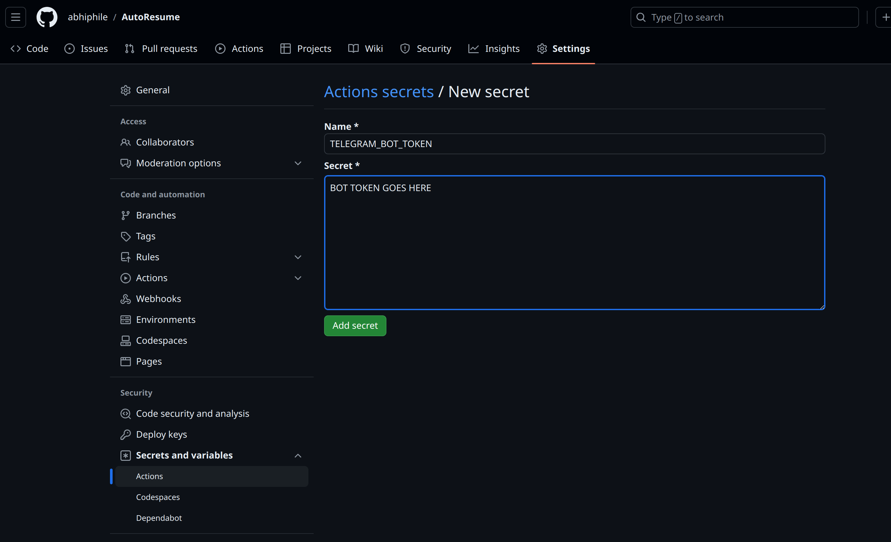
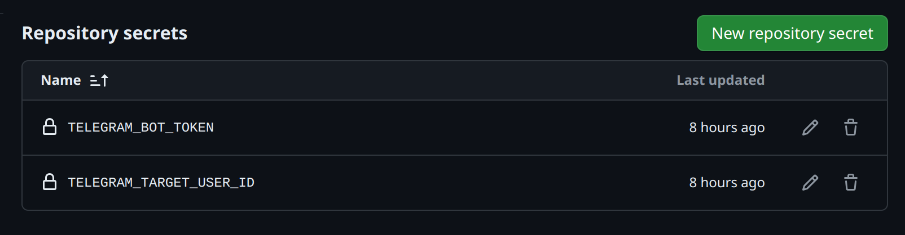
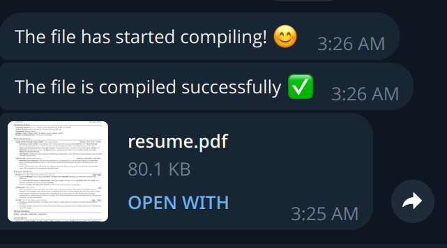

# AutoResume
## Overview
AutoResume is a project designed to automate the generation, compilation, and distribution of resumes using `LaTeX`, integrated with `CI/CD` through `GitHub Actions`. The project includes features to upload the compiled resume to `Telegram` and `Google Drive` and send the link via a `Telegram` bot, providing real-time updates on the upload status.

## Features
- 🔥 **Resume Generation**: Automatically generate a professional resume using `LaTeX`.
- 🔥 **CI/CD Integration**: Utilize `GitHub Actions` for continuous integration and deployment.
- 🔥 **Google Drive Upload**: Upload the compiled resume PDF to `Google Drive`.
- 🔥 **Telegram Bot Integration**: Send the resume PDF and its `Google Drive` link via a `Telegram bot`.
- 🔥 **Status Updates**: Provide real-time status updates on the upload process through the `Telegram bot`.



# Setup Instructions

## Prerequisites
- **GitHub Account**: To host your repository and set up GitHub Actions.
- **Google Drive API Credentials**: To upload files to Google Drive.
- **Telegram Bot Token**: To send messages and files via Telegram.

## Steps
### 1. Make a new telegram bot using `BotFater` and get the Token. Your token will look something like. 
 
### 2. Get the `Chat Id`. If you don't know how to get the chat id follow the following step 3.

### 3. Get Chat ID for a Private Chat in telegram bot.

1. **Search and open our new Telegram bot**
2. **Click Start or send a message**
3. **Open this URL in a browser:**
    ```
    https://api.telegram.org/bot{our_bot_token}/getUpdates
    ```
    - Note: Prefix our token with the word `bot`
    - Example: `https://api.telegram.org/bot63xxxxxx71:AAFoxxxxn0hwA-2TVSxxxNf4c/getUpdates`
4. **You will see a JSON like this:**
    ```json
    {
      "ok": true,
      "result": [
        {
          "update_id": 83xxxxx35,
          "message": {
            "message_id": 2643,
            "from": {...},
            "chat": {
              "id": 21xxxxx38,
              "first_name": "...",
              "last_name": "...",
              "username": "@username",
              "type": "private"
            },
            "date": 1703062972,
            "text": "/start"
          }
        }
      ]
    }
    ```
5. **Check the value of `result[0].message.chat.id`. This is our Chat ID: `21xxxxx38`**
6. **To send a message, use the following URL:**
    ```
    https://api.telegram.org/bot63xxxxxx71:AAFoxxxxn0hwA-2TVSxxxNf4c/sendMessage?chat_id=21xxxxx38&text=test_message
    ```
7. **If the bot token and chat ID are set correctly, the message `test_message` will arrive in our Telegram bot chat.**

### 3. Fork the repo to your github account.
### 4. Follow the following steps to add our `chat id` and `Token` to repository secret.
1. Goto your forked repository `settings/Secrets and Variables/Actions/New repository secret`

2. Add your `chat id` and `Token`

3. Your Repository secrets should look like.


### 5. Clone the forked repo to your local machine and make your resume by using `resume.tex` file and push the changes.

### 6. Within some time you will get a message from the telegram bot you have created.



## 🎉 Congratulations now you will be able get your resume directly into your `telegram bot` every time you make changes to your resume and push it. 